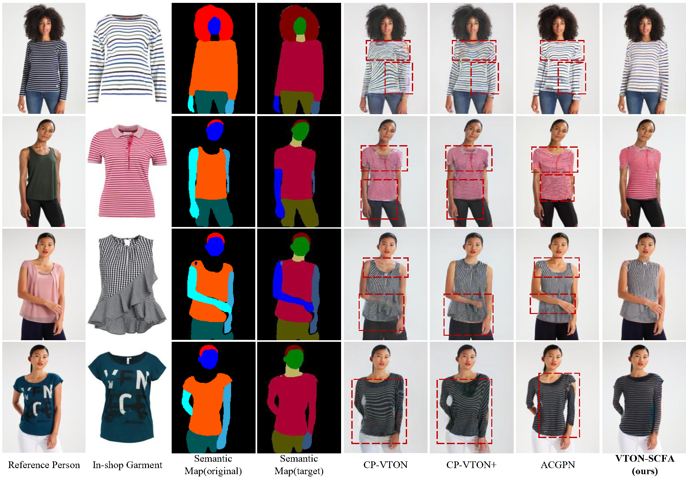

# VTON-SCFA
The official implementation of the paper "VTON-SCFA: A Virtual Try-On Network Based on the Semantic Constraint and Flow Aligning".

<br/><br/>

## Requirements
- python 3.6
- pytorch 1.3.0
- torchvision 0.4.1
- cuda 10.0
- opencv
- numpy

To install requirements:
```setup
conda create -n vscfa python=3.6
conda activate vscfa
conda install pytorch==1.3.0 torchvision==0.4.1 cuda100
pip install tensorboardX
pip install opencv-python==4.1.1
pip install imdb
pip install times==0.7
pip install tqdm==4.49.0
pip install numpy==1.19.2
```

# Usage #
Clone the repo and install requirements through ```pip install -r requirements.txt``` 

## Data Processing
Dataset download instructions and link of dataset can be found from official repo of [CP-VTON](https://github.com/sergeywong/cp-vton) and [VITON](https://github.com/xthan/VITON) </br>
Put dataset in `data` folder


## License
The use of this code is restricted to non-commercial research.

## Acknowledgement 
Thanks for [levindabhi-SieveNet](https://github.com/levindabhi/SieveNet) for providing the useful codes.
